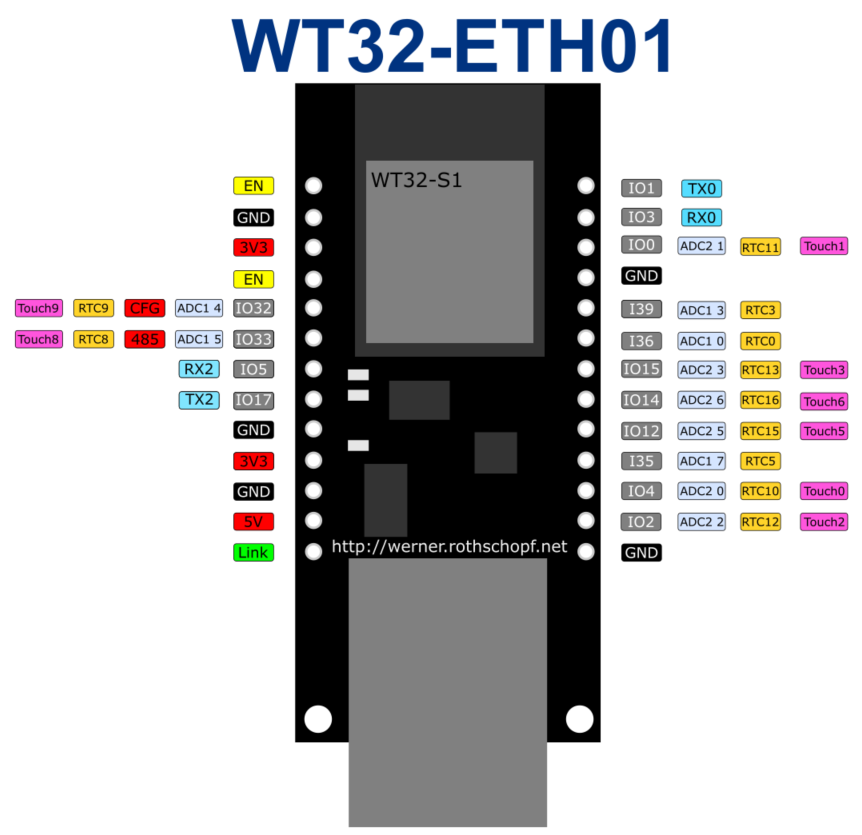
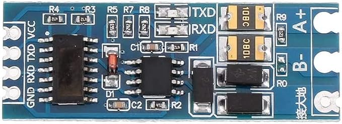
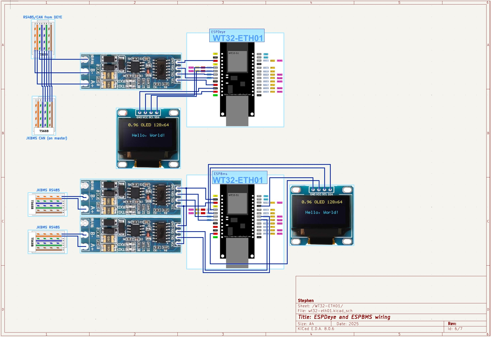
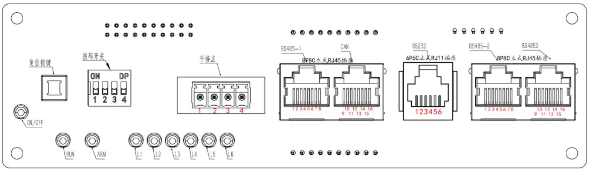

# esphome-solaire
Mon projet solaire

<b>espbms.yaml</b> : Testé sur deux BMS JK-B2A16S (200A)
le RS485 utilisé côté JK n'est pas celui utilisé pour la connection en parallèle des BMS (un master, un slave) mais le RS485 à côté de la connection CAN (vers l'onduleur)

<b>espdeye.yaml</b> : Testé sur un Deye SUN-8K-SG05-LP1-EU SM2
Sur cet onduleur, ne pas utiliser les fils 1/2 du RJ45 "BMS" (marque RS485/CAN), mais le connecteur RJ45 marqué modbus

Carte Home Assistant utilisée pour le Deye : https://github.com/slipx06/sunsynk-power-flow-card

<H3>Matériel utilisé</H3>

<b>ESP32</b> : j'ai choisi un wt32_ETH01 car il intègre un module Ethernet (LAN8720) et un module WiFi. Dans le fichier espdeye.yaml, c'est l'ethernet qui est utilisé.
 

  
Trouvé sur Amazon pour 27€ (les deux) : https://amzn.eu/d/4BWDEwn
 
<b>Adaptateur RS485 -> TTL</b> : Utiliser un module avec contrôle automatique de flux. 

 
Trouvé sur Amazon pour 7€ (les 5) : https://amzn.eu/d/4MC09HF
  
<b>Ecran Oled 0.96" I2C</b> (optionnel) : pour afficher les données localement sur l'ESP32. 

 Trouvé sur Amazon pour 17€ (les 6) : https://amzn.eu/d/6elGV45

 
<h3>Schéma de câblage</h3>

<H4>ESP Deye</H4>

Sur ce schema, le RS485 du module ESPDeye est connecté à l'onduleur Deye SUN-8K-SG05-LP1-EU SM2 via le connecteur RJ45 marqué RS485/BMS utilisé pour relier l'onduleur au BMS. Mais sur le Deye SUN-8K-SG05-LP1-EU SM2, cela ne marche pas, il faut utiliser le connecteur RJ45 marqué modbus (fils 1/2). 
Donc pour ce modèle, 2 RJ45 sortent du Deye (BMS et Modbus) et donc l'ESPDeye n'a pas à "splitter" le signal tel que sur le schema (1-2-3 vers RS485 ESPDeye, 4-5-6-7-8 vers BMS).
 
 
Dans mon cas, j'ai connecté la masse (3) du Deye à la masse (GND) du convertisseur RS485/TTL pour éviter des problèmes de communication. Mais j'ai lu que dans certain cas, il était nécessaire de ne pas la connecter.
 

 
<i>SUN-8K_SG05LP1-EU-SM2</i>
 
 
<ul>
<li>BMS 485/CAN : connexion vers port CAN du BMS master</li>
<li>MODBUS : connexion ESPDeye</li>
</ul>

<H4>ESP BMS</H4>
Le plus simple pour remonter les informations des BMS dans Home Assistant est d'utiliser BatMan et une connexion bluetooth. Dans mon cas, le mini PC executant HA se situe dans une armoire à côté des batteries, et dispose d'une antenne bluetooth puissante.
L'installation est alors simple, sans aucun montage électronique. 
Mais cette configuration impose que les BMS soient connectés en bluetooth à HA en permanence, et donc qu'une connexion via l'application JK du téléphone n'est plus possible (sauf à arrêter Batmon).
 
J'ai donc décidé de connecter les BMS via RS485 à un ESP32 (wt32_ETH01) qui remonte les informations vers HA via ethernet.
Ayant 2 batteries, donc 2 BMS, un master et un slave, j'ai essayé de n'utiliser qu'un seule module RS485/TTL connecté sur un connecteur modbus "parallèle" (qui permet au BMS master de dialoguer avec le slave).
 Mais cela n'a pas fonctionné, il faudrait en effet que ESPBMS soit master pour récuperer les données des 2 BMS, or il ne peut y avoir qu'un seul master. J'ai vu quelques projets essayant de "sniffer" le trafic pour récupérer les données des 2 BMS, mais c'était un peu bricolage (et ça n'a pas fonctionné).
 
J'ai donc utilisé 2 modules RS485/TTL, un pour chaque BMS.
  

 
<i>JK-B2A16S</i>
 
 
<ul>
<li>RS485-1 : connexion ESPBMS</li>
<li>CAN : connexion Deye</li>
<li>RS485-2 et RS4852 : bus modbus pour communication entre BMS master/slave
</ul>

:
